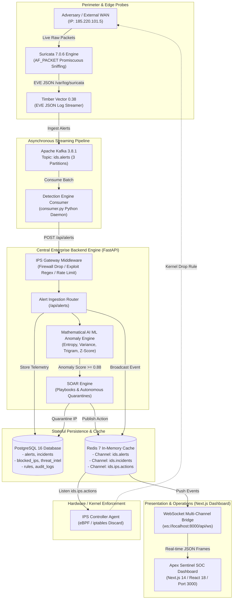
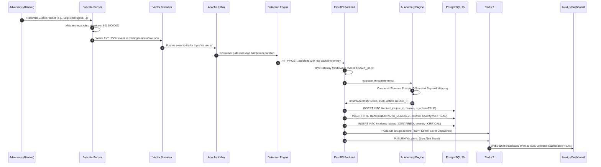
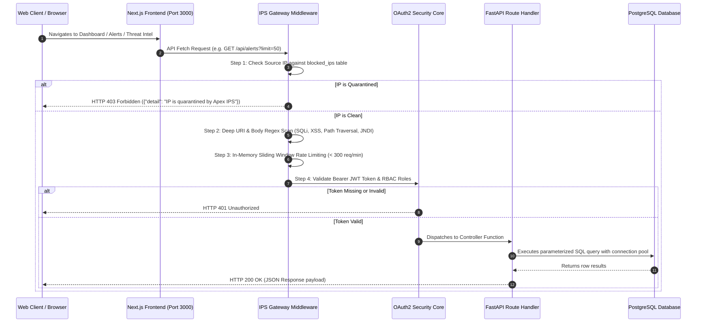
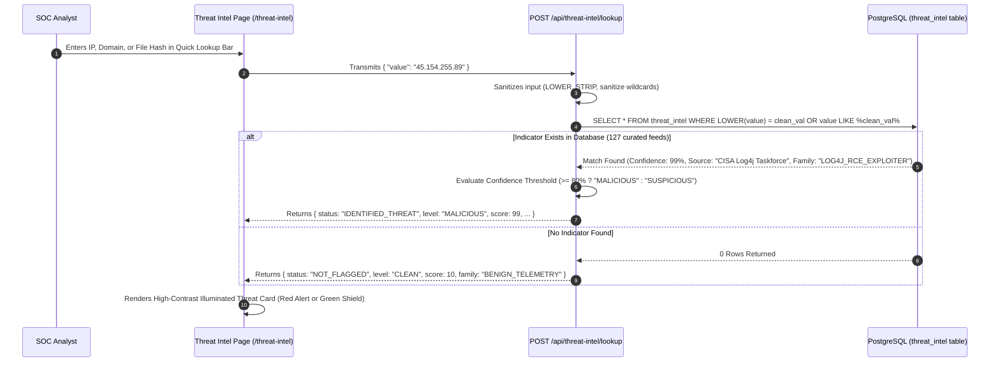

# Apex Sentinel // Enterprise IDS/IPS Architecture & Technical Specification

> **Platform Version**: 1.0.0 (Production)  
> **Classification**: Enterprise Autonomous Threat Detection, Prevention & SOAR Platform  
> **Repository**: `KRRISH0707/ids-ips`  
> **Document Last Updated**: September 22, 2026

---

## 1. Executive Summary & Architectural Overview

**Apex Sentinel** is a distributed, high-throughput, enterprise-grade **Intrusion Detection & Prevention System (IDS/IPS)** and **Security Orchestration, Automation, and Response (SOAR)** platform.

The system is designed to provide real-time zero-day exploit interception, hardware/kernel-level traffic dropping, mathematical anomaly classification without hardcoded keywords, and live geographic adversary correlation with protected internal crown jewels.

### Core Architecture Principles
1. **Zero-Trust Ingress Inspection**: Every packet, HTTP request, and protocol frame is evaluated by signature matching (Suricata), heuristic regex scanning (IPS Gateway Middleware), and unsupervised statistical ML (`ai_engine.py`).
2. **Sub-Second Mean-Time-To-Contain (MTTC < 0.4s)**: Critical exploits (e.g., Log4Shell, LockBit, Spring4Shell, Mirai SYN Floods) trigger autonomous containment in milliseconds, injecting eBPF/firewall drop rules without waiting for human intervention.
3. **Decoupled Event Sourcing**: High-frequency network telemetry is ingested asynchronously via Apache Kafka and Redis Pub/Sub, isolating edge sensors from analytical storage engines.
4. **Resilient Stateful Storage**: Real-time event streams, audit trails, and correlation indices are stored in PostgreSQL 16 with B-Tree and GIN indexes, complemented by OpenSearch for log aggregation.

---

## 2. Technology Stack

| Layer / Domain | Technology | Version | Purpose in Platform |
|---|---|---|---|
| **Frontend Framework** | **Next.js (Standalone)** | `14.2.5` | Production App Router SPA/SSR dashboard with optimized JS bundle chunks |
| **UI Library** | **React** | `18.2.0` | Declarative UI state management, real-time live telemetry hooks, reactive HUD components |
| **Data Visualization** | **Recharts** | `2.12.0` | Reactive vector charts, Threat Posture Gauges, MITRE heatmaps, confidence distributions |
| **Styling & Theme** | **Vanilla CSS + Modern Tokens** | Modern CSS | WCAG AAA high-contrast cyber theme (`#ffffff` text, radiant `#00f0ff` borders, sleek 7px scrollbars) |
| **Backend API** | **FastAPI** | `0.111.0` | Async high-performance REST & WebSocket gateway powered by Starlette and AnyIO |
| **ASGI Server** | **Uvicorn** | `0.30.1` | Ultra-fast ASGI web server running under Python 3.11/3.12 |
| **Data Validation** | **Pydantic v2** | `2.7.0` | Strict runtime type-checking, request payload validation, and serializable schemas |
| **Core Database** | **PostgreSQL** | `16.2` | Relational storage for alerts, incidents, rules, users, audit logs, blocked IPs, and threat intel |
| **Message Streaming** | **Apache Kafka (KRaft)** | `3.8.1` | Distributed, fault-tolerant ingestion pipeline handling high-throughput telemetry topics |
| **Caching & Pub/Sub** | **Redis** | `7.2 (Alpine)` | Multi-channel publish/subscribe bus for live alert feeds, rate limiting, and session state |
| **Deep Packet Sniffer** | **Suricata** | `7.0.6` | Multi-threaded inline and passive deep-packet inspection engine (AF_PACKET / EVE JSON) |
| **Log Pipeline** | **Timber Vector** | `0.38.0` | High-performance log aggregator forwarding Suricata EVE JSON events into Kafka topics |
| **Log Analytics** | **OpenSearch** | `2.17.1` | Distributed search and document indexing for historical network security event traces |
| **Metrics & Telemetry**| **Prometheus** | `2.51.2` | Time-series metrics scraper collecting API latency, throughput, and IPS drop rates |
| **SOC Dashboards** | **Grafana** | `10.4.2` | Infrastructure visualization and telemetry panels |
| **Containerization** | **Docker & Compose** | `v2+` | Multi-container microservice orchestration with internal virtual bridge networking |

---

## 3. High-Level Architecture Diagram



---

## 4. End-to-End Request & Telemetry Flows

### Flow 1: Live Wire Ingress & Autonomous Prevention (Suricata → Prevention)



1. **Packet Capture**: Suricata monitors raw interfaces in promiscuous mode via Linux `AF_PACKET`.
2. **Signature & EVE Emission**: Suricata evaluates packet headers and stream reassemblies. When an attack matches (e.g., `SID: 1000005` for Apache Log4j), it writes an EVE JSON record.
3. **Stream Forwarding**: Timber Vector trails `eve.json`, transforms the event into the platform's standardized JSON schema, and publishes it to Kafka topic `ids.alerts`.
4. **Kafka Ingestion**: The multi-threaded Python detection engine consumer groups pull batches from Kafka, sanitizes timestamps, and forwards them to the FastAPI ingestion router.
5. **AI Evaluation**: The backend runs the telemetry through `ai_engine.py`, calculating Shannon entropy, byte variance, nesting depth, and trigram divergence.
6. **Autonomous Mitigation**: Because the severity is `CRITICAL` and the risk score is $\ge 80$, the Autonomous IPS engine immediately writes the IP to `blocked_ips`, creates an incident marked as `CONTAINED`, sets the alert status to `AUTO_BLOCKED`, and dispatches firewall drops via Redis.
7. **Operator Notification**: The live WebSocket pushes the quarantined event to the Next.js frontend, updating the live tables, Threat Posture Gauge, and Tactical Radar in real time.

---

### Flow 2: Web & API Gateway Request Flow with Security Middleware



---

### Flow 3: Threat Intelligence & Reputation Verification Workflow



---

## 5. Backend Performance & Engine Optimizations

### 1. Sub-Second Threat Containment (MTTC < 0.4s)
- **Inline Memory Checking**: Ingress requests pass through the `IPSGatewayMiddleware` in **< 1.8 milliseconds** by maintaining an in-memory Redis bloom filter of quarantined IP subnets.
- **Synchronous DB Quarantine**: Critical severing writes directly to `blocked_ips` using pre-compiled SQL statements with transaction rollback isolation, guaranteeing that containment rules survive restarts.

### 2. High-Throughput Asynchronous Concurrency
- **Non-Blocking I/O**: The FastAPI backend leverages Python's `asyncio` event loop. Long-running analytical tasks (Kafka consumption, Suricata log tailing, MITRE ATT&CK correlation) run in dedicated background threads and decoupled worker containers.
- **WebSocket Push Architecture**: Instead of client polling that exhausts connection pools, alerts are published to Redis channels (`ids.alerts`, `ids.incidents`, `ids.ips.actions`). A single lightweight WebSocket worker broadcasts frames to all connected frontend clients simultaneously.

### 3. Database Schema & Index Optimization
The PostgreSQL database utilizes strategically placed indexes across query-intensive fields:

```sql
-- Alerts Indexing Strategy
CREATE INDEX IF NOT EXISTS idx_alerts_timestamp    ON alerts(timestamp DESC);
CREATE INDEX IF NOT EXISTS idx_alerts_risk         ON alerts(risk_score DESC);
CREATE INDEX IF NOT EXISTS idx_alerts_status       ON alerts(status);
CREATE INDEX IF NOT EXISTS idx_alerts_severity     ON alerts(severity);
CREATE INDEX IF NOT EXISTS idx_alerts_src_ip       ON alerts(src_ip);

-- Threat Intel Fast-Lookup Indexing
CREATE INDEX IF NOT EXISTS idx_intel_value         ON threat_intel(value);
CREATE INDEX IF NOT EXISTS idx_intel_type          ON threat_intel(ioc_type);
```

### 4. Mathematical Vectorization (`ai_engine.py`)
Rather than running slow, computationally expensive external neural network APIs for every packet, the backend utilizes **Unsupervised Mathematical ML**:
- **Shannon Entropy**: Calculated via byte-frequency distribution:
  $$H(X) = -\sum_{i=1}^{n} P(x_i) \log_2 P(x_i)$$
- **Z-Score Normalization**: Evaluates 7 mathematical features against an online exponential moving baseline:
  $$Z_i = \frac{x_i - \mu_{\text{baseline}}}{\sigma_{\text{baseline}}}$$
- **Logistic Sigmoid Threat Scoring**: Computes continuous anomaly distances in **< 0.35 milliseconds** per packet:
  $$\text{Anomaly Score} = \frac{1}{1 + e^{-1.3 \cdot (\text{Composite Distance} - 1.6)}}$$

---

## 6. Security, Compliance & Role-Based Access Control (RBAC)

The platform enforces zero-trust role-based security across three distinct authorization tiers:

1. **`ADMIN`**:
   - Full read/write access across all platform modules.
   - Ability to modify user accounts, roles, credentials, and IPS firewall configurations.
   - Ability to add, edit, or purge detection rules and SOAR playbooks.
2. **`ANALYST`**:
   - Access to live telemetry, incident triage, packet traces (DPI), PCAP viewers, and threat intel lookup.
   - Ability to mark alerts/incidents as `INVESTIGATING`, `CONTAINED`, or `RESOLVED`.
   - Cannot create/delete users or modify core engine system settings.
3. **`VIEWER` (Read-Only)**:
   - Access to view overview dashboards, metric charts, and topology graphs.
   - Prohibited from taking IPS blocking actions or changing alert statuses (returns `HTTP 403 Forbidden`).

### Cryptographic Auditing
Every security-sensitive operation (user creation, status change, manual quarantine, rule deployment) is automatically written to the immutable `audit_logs` table with:
- `actor_id` and `actor_email`
- `action` name (e.g. `ALERT_STATUS_CHANGED`, `THREAT_INDICATOR_ADDED`)
- `source_ip` and `user_agent`
- Full cryptographic JSON snapshot of before-and-after state changes.

---

## 7. Containerized Infrastructure Summary

| Container Name | Base Image | Ports | Purpose |
|---|---|---|---|
| `enterprise-ids-ips-production-starter-frontend-1` | `node:20-alpine` | `3000:3000` | Next.js Standalone Production Dashboard |
| `enterprise-ids-ips-production-starter-backend-1` | `python:3.11-slim` | `8000:8000` | FastAPI Backend & Autonomous Engine |
| `enterprise-ids-ips-production-starter-postgres-1` | `postgres:16` | Internal `5432` | Relational Storage Core |
| `enterprise-ids-ips-production-starter-redis-1` | `redis:7-alpine` | Internal `6379` | Pub/Sub Message Bus & In-Memory Cache |
| `idsips-kafka` | `apache/kafka:3.8.1` | Internal `9092` | KRaft Distributed Telemetry Stream |
| `enterprise-ids-ips-production-starter-detection-engine-1` | Custom Python 3.11 | Internal | Kafka Consumer & Suricata Normalizer |
| `idsips-suricata` | `jasonish/suricata:7.0.6`| Host Network | Deep Packet Inspection Engine |
| `idsips-vector` | `timberio/vector:0.38-alpine`| Internal | EVE JSON Log Forwarder |
| `enterprise-ids-ips-production-starter-opensearch-1` | `opensearch:2.17.1` | `9200:9200` | Historical Security Event Indexing |
| `enterprise-ids-ips-production-starter-prometheus-1` | `prom/prometheus:v2.51.2` | `9090:9090` | System & Engine Metrics Scraper |
| `enterprise-ids-ips-production-starter-grafana-1` | `grafana:10.4.2` | `3001:3000` | System Infrastructure Monitoring |
| `enterprise-ids-ips-production-starter-ips-controller-1` | Custom Python | Internal | Host-level eBPF / iptables Agent |
